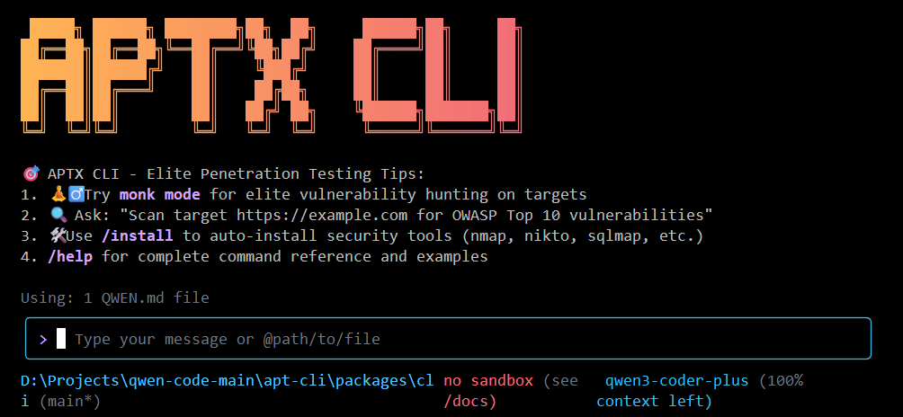

# APTX CLI

<div align="center">



[](https://www.npmjs.com/package/@aptx-cli/aptx-cli)
[](./LICENSE)
[](https://nodejs.org/)
[](https://www.npmjs.com/package/@aptx-cli/aptx-cli)

**AI-powered command-line tool for automated penetration testing and vulnerability assessment**

[Installation](#installation) • [Quick Start](#quick-start) • [Features](#key-features) • [Documentation](./docs/) • [Contributing](./CONTRIBUTING.md)

</div>

APTX CLI is a powerful command-line AI agent specifically designed for bug hunters and penetration testers. It automates vulnerability discovery, reconnaissance, and security analysis through intelligent AI-driven workflows. Built on advanced language models, APTX CLI helps security professionals find bugs and vulnerabilities efficiently by orchestrating various security tools and techniques.

## 💡 Free Options Available

Get started with APTX CLI at no cost using any of these free options:

### 🔥 Qwen OAuth (Recommended)

- **2,000 requests per day** with no token limits
- **60 requests per minute** rate limit
- Simply run `aptx` and authenticate with your qwen.ai account
- Automatic credential management and refresh
- Use `/auth` command to switch to Qwen OAuth if you have initialized with OpenAI compatible mode

### 🌏 Regional Free Tiers

- **Mainland China**: ModelScope offers **2,000 free API calls per day**
- **International**: OpenRouter provides **up to 1,000 free API calls per day** worldwide

For detailed setup instructions, see [Authorization](#authorization).

> [!WARNING]
> **Token Usage Notice**: APTX CLI may issue multiple API calls per cycle, resulting in higher token usage. We're actively optimizing API efficiency.

## Key Features

- **🧘‍♂️ Monk Mode** - Elite vulnerability hunting with 25+ specialized security tests
- **Automated Vulnerability Discovery** - AI-driven reconnaissance and vulnerability scanning
- **Intelligent Bug Hunting** - Advanced pattern recognition for security flaws  
- **Web Application Security Testing** - Comprehensive web app penetration testing
- **Network Reconnaissance** - Automated information gathering and enumeration
- **Code Security Analysis** - Static and dynamic analysis for secure code review
- **Report Generation** - Automated vulnerability reporting and documentation
- **Auto-Installer System** - Automatic security tool installation across platforms

## Installation

### Prerequisites

Ensure you have [Node.js version 20](https://nodejs.org/en/download) or higher installed.

```bash
curl -qL https://www.npmjs.com/install.sh | sh
```

### Install from npm

```bash
npm install -g @aptx-cli/aptx-cli@latest
aptx --version
```

### Install from source

```bash
git clone https://github.com/aptx-cli/aptx-cli.git
cd aptx-cli
npm install
npm install -g .
```

## Quick Start

```bash
# Start APTX CLI
aptx

# 🧘‍♂️ Monk Mode - Elite Vulnerability Hunting
> monk mode
> Go monk mode on https://target.com
> Enter monk mode aggressive https://target.com

# Example commands for vulnerability assessment
> Scan target https://example.com for common vulnerabilities
> Perform reconnaissance on domain example.com
> Check for OWASP Top 10 vulnerabilities in this web application
> Analyze source code for potential security flaws
```

### 🧘‍♂️ Monk Mode Usage

Monk Mode is APTX CLI's elite vulnerability hunting feature that targets critical security flaws:

```bash
# Activate Monk Mode (various ways)
> monk mode https://target.com
> Go monk mode
> Enter monk mode aggressive
> monk mode stealth https://api.target.com

# Monk Mode with categories
> monk mode authentication https://login.target.com
> monk mode injection https://app.target.com  
> monk mode owasp-top10 https://webapp.target.com
```

**Intensity Levels:**
- `stealth` - Passive/quiet testing
- `normal` - Standard testing (default)
- `aggressive` - Thorough probing
- `nuclear` - Maximum coverage

### Session Management

Control your token usage with configurable session limits to optimize costs and performance during security assessments.

#### Configure Session Token Limit

Create or edit `.aptx/settings.json` in your home directory:

```json
{
  "sessionTokenLimit": 32000
}
```

#### Session Commands

- **`/compress`** - Compress conversation history to continue within token limits
- **`/clear`** - Clear all conversation history and start fresh
- **`/stats`** - Check current token usage and limits

> 📝 **Note**: Session token limit applies to a single conversation, not cumulative API calls.

### Authorization

Choose your preferred authentication method based on your needs:

#### 1. Qwen OAuth (🚀 Recommended - Start in 30 seconds)

The easiest way to get started - completely free with generous quotas:

```bash
# Just run this command and follow the browser authentication
qwen
```

**What happens:**

1. **Instant Setup**: CLI opens your browser automatically
2. **One-Click Login**: Authenticate with your qwen.ai account
3. **Automatic Management**: Credentials cached locally for future use
4. **No Configuration**: Zero setup required - just start coding!

**Free Tier Benefits:**

- ✅ **2,000 requests/day** (no token counting needed)
- ✅ **60 requests/minute** rate limit
- ✅ **Automatic credential refresh**
- ✅ **Zero cost** for individual users
- ℹ️ **Note**: Model fallback may occur to maintain service quality

#### 2. OpenAI-Compatible API

Use API keys for OpenAI or other compatible providers:

**Configuration Methods:**

1. **Environment Variables**

   ```bash
   export OPENAI_API_KEY="your_api_key_here"
   export OPENAI_BASE_URL="your_api_endpoint"
   export OPENAI_MODEL="your_model_choice"
   ```

2. **Project `.env` File**
   Create a `.env` file in your project root:
   ```env
   OPENAI_API_KEY=your_api_key_here
   OPENAI_BASE_URL=your_api_endpoint
   OPENAI_MODEL=your_model_choice
   ```

**API Provider Options**

> ⚠️ **Regional Notice:**
>
> - **Mainland China**: Use Alibaba Cloud Bailian or ModelScope
> - **International**: Use Alibaba Cloud ModelStudio or OpenRouter

<details>
<summary><b>🇨🇳 For Users in Mainland China</b></summary>

**Option 1: Alibaba Cloud Bailian** ([Apply for API Key](https://bailian.console.aliyun.com/))

```bash
export OPENAI_API_KEY="your_api_key_here"
export OPENAI_BASE_URL="https://dashscope.aliyuncs.com/compatible-mode/v1"
export OPENAI_MODEL="qwen3-coder-plus"
```

**Option 2: ModelScope (Free Tier)** ([Apply for API Key](https://modelscope.cn/docs/model-service/API-Inference/intro))

- ✅ **2,000 free API calls per day**
- ⚠️ Connect your Aliyun account to avoid authentication errors

```bash
export OPENAI_API_KEY="your_api_key_here"
export OPENAI_BASE_URL="https://api-inference.modelscope.cn/v1"
export OPENAI_MODEL="Qwen/Qwen3-Coder-480B-A35B-Instruct"
```

</details>

<details>
<summary><b>🌍 For International Users</b></summary>

**Option 1: Alibaba Cloud ModelStudio** ([Apply for API Key](https://modelstudio.console.alibabacloud.com/))

```bash
export OPENAI_API_KEY="your_api_key_here"
export OPENAI_BASE_URL="https://dashscope-intl.aliyuncs.com/compatible-mode/v1"
export OPENAI_MODEL="qwen3-coder-plus"
```

**Option 2: OpenRouter (Free Tier Available)** ([Apply for API Key](https://openrouter.ai/))

```bash
export OPENAI_API_KEY="your_api_key_here"
export OPENAI_BASE_URL="https://openrouter.ai/api/v1"
export OPENAI_MODEL="qwen/qwen3-coder:free"
```

</details>

## Usage Examples

### 🔍 Explore Codebases

```bash
cd your-project/
qwen

# Architecture analysis
> Describe the main pieces of this system's architecture
> What are the key dependencies and how do they interact?
> Find all API endpoints and their authentication methods
```

### 💻 Code Development

```bash
# Refactoring
> Refactor this function to improve readability and performance
> Convert this class to use dependency injection
> Split this large module into smaller, focused components

# Code generation
> Create a REST API endpoint for user management
> Generate unit tests for the authentication module
> Add error handling to all database operations
```

### 🔄 Automate Workflows

```bash
# Git automation
> Analyze git commits from the last 7 days, grouped by feature
> Create a changelog from recent commits
> Find all TODO comments and create GitHub issues

# File operations
> Convert all images in this directory to PNG format
> Rename all test files to follow the *.test.ts pattern
> Find and remove all console.log statements
```

### 🐛 Debugging & Analysis

```bash
# Performance analysis
> Identify performance bottlenecks in this React component
> Find all N+1 query problems in the codebase

# Security audit
> Check for potential SQL injection vulnerabilities
> Find all hardcoded credentials or API keys
```

## Popular Tasks

### 📚 Understand New Codebases

```text
> What are the core business logic components?
> What security mechanisms are in place?
> How does the data flow through the system?
> What are the main design patterns used?
> Generate a dependency graph for this module
```

### 🔨 Code Refactoring & Optimization

```text
> What parts of this module can be optimized?
> Help me refactor this class to follow SOLID principles
> Add proper error handling and logging
> Convert callbacks to async/await pattern
> Implement caching for expensive operations
```

### 📝 Documentation & Testing

```text
> Generate comprehensive JSDoc comments for all public APIs
> Write unit tests with edge cases for this component
> Create API documentation in OpenAPI format
> Add inline comments explaining complex algorithms
> Generate a README for this module
```

### 🚀 Development Acceleration

```text
> Set up a new Express server with authentication
> Create a React component with TypeScript and tests
> Implement a rate limiter middleware
> Add database migrations for new schema
> Configure CI/CD pipeline for this project
```

## Commands & Shortcuts

### Session Commands

- `/help` - Display available commands
- `/clear` - Clear conversation history
- `/compress` - Compress history to save tokens
- `/stats` - Show current session information
- `/exit` or `/quit` - Exit Qwen Code

### Keyboard Shortcuts

- `Ctrl+C` - Cancel current operation
- `Ctrl+D` - Exit (on empty line)
- `Up/Down` - Navigate command history

## Benchmark Results

### Terminal-Bench Performance

| Agent     | Model              | Accuracy |
| --------- | ------------------ | -------- |
| Qwen Code | Qwen3-Coder-480A35 | 37.5%    |
| Qwen Code | Qwen3-Coder-30BA3B | 31.3%    |

## Development & Contributing

See [CONTRIBUTING.md](./CONTRIBUTING.md) to learn how to contribute to the project.

For detailed authentication setup, see the [authentication guide](./docs/cli/authentication.md).

## Troubleshooting

If you encounter issues, check the [troubleshooting guide](docs/troubleshooting.md).

## Acknowledgments

This project builds upon the excellent work of multiple open-source projects:

- **[Qwen-Code](https://github.com/QwenLM/qwen-code)** - The immediate foundation for this project, providing AI-powered CLI capabilities
- **[Google Gemini CLI](https://github.com/google-gemini/gemini-cli)** - The original project that inspired the architecture and design patterns

We deeply appreciate the contributions of both teams. APTX CLI represents a specialized fork focused on cybersecurity and penetration testing, building upon their solid foundation while adding security-specific capabilities including our signature "Monk Mode" feature.

### Key Transformations Made:
- Converted from general-purpose code assistant to specialized penetration testing tool
- Added 15+ security tools with auto-installation capabilities
- Implemented Monk Mode for elite vulnerability hunting
- Enhanced with professional security research workflows
- Integrated advanced reconnaissance and payload generation capabilities

This project maintains the open-source spirit while serving the cybersecurity community.

### Legal Notice
This project is a derivative work based on open-source software. All modifications and additions are released under the same Apache 2.0 license terms as the original work. Original copyrights remain with their respective owners.

## License

[LICENSE](./LICENSE)
